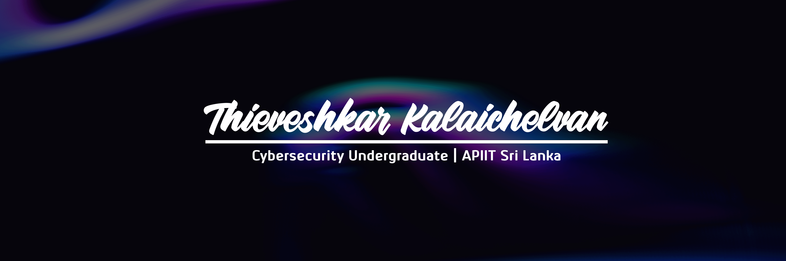

<h1 align="center">Hi 👋, I'm Thieveshkar</h1>
<h3 align="center">I am a second-year Cyber Security undergraduate at APIIT Sri Lanka, affiliated with Staffordshire University, UK. As a Web Development Intern at Infinity Co., I am gaining valuable industry experience while refining my technical and problem-solving skills. With a creative edge in graphic design, I bring expertise in Adobe Illustrator, Photoshop, Premiere Pro, and After Effects to craft engaging digital content. Passionate about cybersecurity and technology, I am committed to continuous learning and collaboration to drive meaningful impact in the digital landscape.</h3>

## 🌐 Socials:
 

# 💻 Languages and Tools:
             

# 📊 GitHub Stats:

 
 

