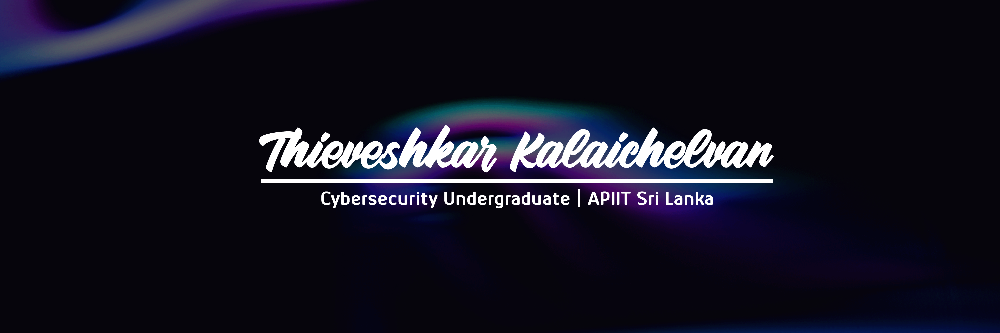

<h1 align="center">Hi 👋, I'm Thieveshkar</h1>
<h2 align="center">I am a Final Year Cyber Security undergraduate at APIIT Sri Lanka, affiliated with Staffordshire University, UK. Currently, I am leveraging my technical skills as a Security Operations Center (SOC) Intern at Connex Information Technologies, while also managing web development projects for Infinitystore. With a creative edge in graphic design, I bring expertise in Adobe Illustrator, Photoshop, Premiere Pro, and After Effects to craft engaging digital content. Passionate about cybersecurity, secure development, and technology, I am committed to continuous learning and collaboration to drive meaningful impact in the digital landscape.</h2>

###

  
  

###

###

  <!-- Cyber Security & Systems -->
  
  
  
  
  
  
  
  
  
  
  
  <!-- Web Development -->
  
  
  
  
  
  
  
  
  
  
  
  
    

  <!-- Design & Creative -->
  
  
  
  
  
  
  

###

  

###

 

###
